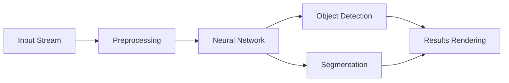

# Computer Vision Architectures


High-performance computer vision architectures optimized for real-time inference and complex image analysis.

## System Architecture



## Business Impact
- **Industrial Automation:** Increases quality control accuracy by 40% through automated defect detection.
- **Enhanced Security:** Enables real-time surveillance monitoring with intelligent anomaly detection.
- **Data Insights:** Extracts valuable metadata from visual sources for retail and urban planning.

## Installation Guide
1. Clone the repository:
   ```bash
   git clone https://github.com/Krishnaandey25/Computer-Vision-Architectures.git
   ```
2. Install requirements:
   ```bash
   pip install -r requirements.txt
   ```
3. Run the vision engine:
   ```bash
   python src/main.py
   ```
